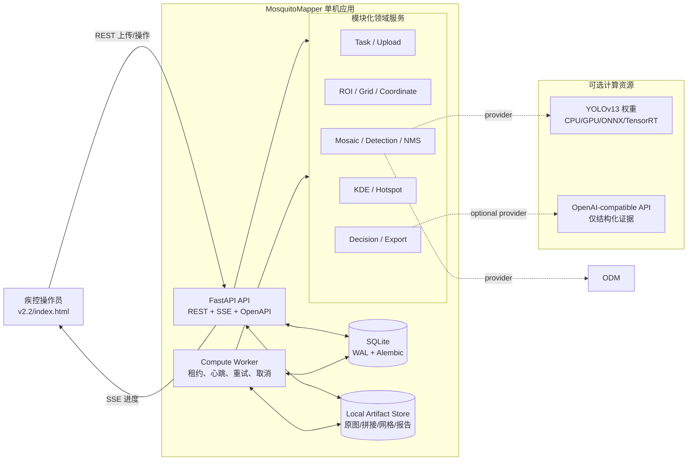
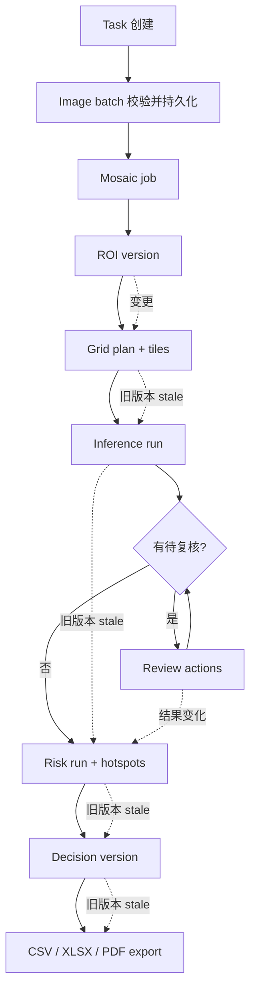
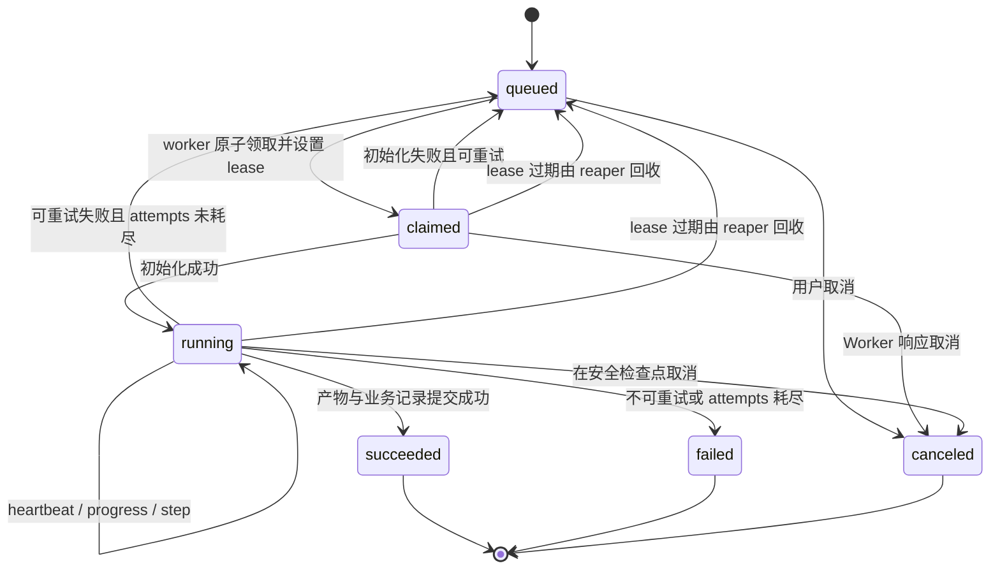
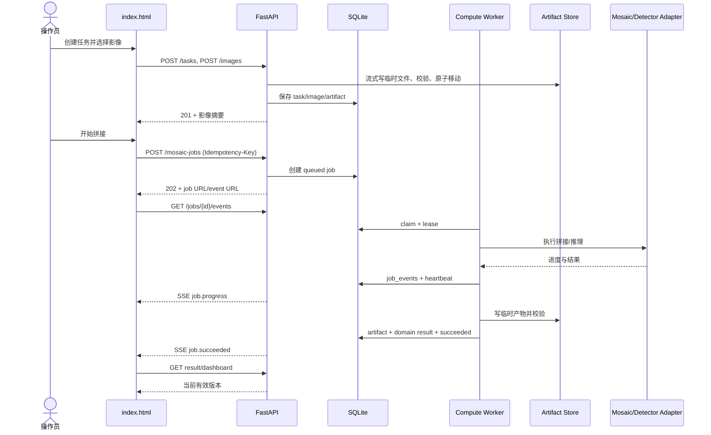
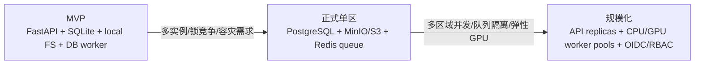

# 系统架构与任务状态机

## 1. 架构目标

这套架构同时满足两个看似冲突的目标：MVP 保持零/低成本和单机可部署；耗时的航拍拼接、YOLO 推理和报告生成又必须具备持久进度、失败恢复和清晰的升级路径。

因此采用“模块化单体 + 独立 Worker + 数据库作业队列”，而不是在 FastAPI 请求中直接计算，也暂不引入微服务、Redis 或 Celery。

## 2. 容器/进程架构图



## 3. 组件职责

| 组件 | 负责 | 不负责 |
|---|---|---|
| FastAPI | 参数校验、短事务、资源 API、SSE、artifact 流式下载 | 拼接、推理、PDF 等长任务 |
| Worker | claim 作业、心跳、阶段进度、计算、原子提交产物、重试/恢复 | 面向浏览器提供接口 |
| SQLite | 业务实体、作业状态、事件、元数据、审计 | 存储影像二进制 |
| Artifact Store | 原图、拼接图、网格、预测 JSON、热图、报表 | 判断资源归属和授权 |
| MosaicEngine | SCANS 像素级拼接 adapter | 业务状态、HTTP 响应 |
| Detector | 模型加载、批量预测、标准化 detection | 人工复核和风险分级 |
| RiskService | 从已接受检测计算 KDE/热点/统计 | 生成自然语言建议 |
| DecisionProvider | 把结构化证据转为建议 schema | 决定最终现场行动 |

## 4. 七阶段业务与后端能力映射



虚线代表依赖失效，而不是删除历史。历史结果继续保留用于审计，但 `is_current=false` 或 `status=stale`。

## 5. 异步 Job 状态机

### 5.1 状态图



### 5.2 领取与租约

SQLite 仍只有一个 writer，因此领取事务必须极短：

1. 查询最早且可运行的 `queued` job；
2. 使用 `UPDATE ... WHERE status='queued' AND id=?` 抢占；
3. 同一事务写入 `worker_id`、`claimed_at`、`lease_expires_at`、`attempt_count+1`；
4. 受影响行数为 1 才算领取成功；
5. 计算阶段不持有数据库事务；每隔 `lease_seconds / 3` 更新心跳；
6. Reaper 将超期的 `claimed/running` job 重新排队，或在超过最大尝试次数后标 failed。

每种处理器必须定义幂等边界。先写临时产物，计算哈希和元数据，最后在短事务中登记 artifact 并把 job 置成功，然后原子重命名到最终位置。重试时发现相同 input fingerprint 的完整产物可以复用。

### 5.3 Job 类型与步骤

| Job type | 建议步骤 |
|---|---|
| `mosaic` | preflight → submit/process → render → quality_check → persist |
| `grid_generate` | validate_roi → enumerate → crop_pad → metadata → persist |
| `inference` | load_model → load_tiles → detect → map → nms → persist → review_queue |
| `risk_analysis` | load_effective_detections → kde → normalize → contours → persist |
| `decision_generate` | build_evidence → provider → validate_schema → persist |
| `export_csv/xlsx/pdf` | snapshot → render → validate_artifact → persist |

## 6. 端到端时序图



## 7. 上游变更与依赖失效

依赖图：

```text
images ──> mosaic ──> rois ──> grid_plan ──> inference_run
                                              │
review_actions ────────────────────────────────┤
                                              v
                                          risk_run ──> decision ──> exports
```

建议把每次派生输入规范化后计算 SHA-256：

```json
{
  "operation": "inference",
  "grid_plan_id": "...",
  "grid_plan_fingerprint": "...",
  "model_sha256": "...",
  "confidence": 0.2,
  "review_threshold": 0.5,
  "auto_accept_threshold": 0.8,
  "nms_iou": 0.45
}
```

如果 fingerprint 与现有成功 run 相同，幂等请求直接复用；不同则创建新 run，并将依赖旧 run 的风险、建议和导出标记 stale。

## 8. 拼接引擎策略

当前正式策略固定为 OpenCV SCANS 仿射拼接；Provider 只保留生产与测试两层：

| Provider | 用途 | 输出与限制 |
|---|---|---|
| Fake | 自动化测试与前端演示 | 确定性小图，必须标 demo |
| OpenCV | 至少 2 张、近似共面、重叠充分的正式拼接 | SCANS 仿射模型；输出 JPEG 和 pixel 坐标，不含 CRS/GSD |

OpenCV Provider 默认先把原图缩放到 0.6 工作尺度，使用 0.3 置信阈值完成特征匹配、仿射配准、曝光/接缝融合，再以阈值 2 裁黑边并输出 JPEG 95。原图默认不做逐张去噪、对比度增强或锐化。结果是像素级拼接图，不得标记为测绘级正射成果。

## 9. YOLOv13 接入边界

YOLOv13 官方仓库示例基于 Python 3.11 和 `ultralytics.YOLO`，支持导出 ONNX/TensorRT：[官方仓库](https://github.com/iMoonLab/yolov13)。适配器不应让这一实现细节渗入业务服务：

```python
class Detector(Protocol):
    def metadata(self) -> ModelMetadata: ...
    def warmup(self) -> None: ...
    def predict(self, images: Sequence[ImageInput], params: DetectParams) -> list[TilePrediction]: ...
```

业务层只依赖标准 `TilePrediction`。未来 CPU PyTorch、CUDA、ONNX Runtime 或 TensorRT 都能通过 provider 切换。模型元数据至少留存：权重 SHA-256、类别映射、输入尺寸、provider、设备、代码版本、加载时间。

## 10. SSE 设计

SSE 适合服务器单向推送任务进度，浏览器原生 `EventSource` 可使用；FastAPI 官方实现还处理 15 秒 keepalive、no-cache 和 Nginx buffering header：[FastAPI SSE](https://fastapi.tiangolo.com/tutorial/server-sent-events/)。

设计要点：

- 事件先持久化再推送；SSE 不是状态的唯一来源；
- `id` 等于 job_event 的递增 sequence；
- 收到 `Last-Event-ID` 后补发后续事件；
- 首条发送 `snapshot`，避免客户端遗漏之前状态；
- 终态后发送一次 terminal event 并结束；
- 客户端连不上时轮询 `GET /jobs/{id}`；
- 代理层关闭响应缓冲并提高长连接超时。

## 11. SQLite 的适用边界

SQLite WAL 允许 reader 与 writer 并行，但仍只有一个 writer，并依赖数据库、`-wal`、`-shm` 位于同一主机文件系统；官方文档还提醒长读事务可能造成 checkpoint starvation：[SQLite WAL](https://www.sqlite.org/wal.html)。因此：

- API 与 Worker 必须在同一台机器/同一个本地持久卷上；不要把 SQLite 放 NFS；
- 所有数据库事务都短，严禁计算时持有事务；
- 配置 busy timeout；对 `SQLITE_BUSY` 做有限、带抖动重试；
- 定期观察 WAL 大小并做安全 checkpoint；
- 单机只开有限 Worker 并发，GPU 通常为 1，CPU 依据实测；
- 出现多主机、多实例、高并发写或持续锁等待即迁 PostgreSQL。

## 12. 正式化升级路线



迁移的关键是保持 repository、artifact store、MosaicEngine、Detector、DecisionProvider 边界稳定，而不是提前部署全部企业组件。
