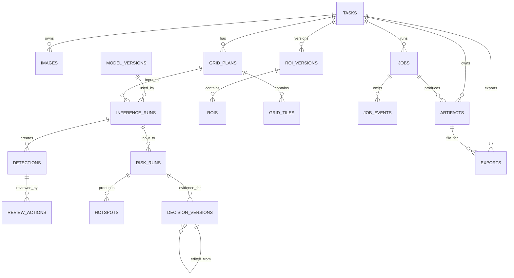

# 数据模型与文件存储

## 1. 设计原则

1. SQLite 只存可查询的业务、状态和元数据，不存影像 BLOB。
2. 原始预测与报告快照保留不可变版本；人工修改以追加记录实现。
3. 所有派生产物绑定 input fingerprint，支持幂等复用和上游变更后的 stale 标记。
4. 服务器只持久化相对 `STORAGE_ROOT` 的路径；绝对路径永不返回给客户端。
5. SQLite 下 JSON 字段用 TEXT + 应用层 Pydantic 校验；迁 PostgreSQL 后可改 JSONB。

## 2. ER 图



## 3. 表定义

下列字段是最小集合。迁移中还应统一加入必要索引和外键。

### 3.1 `tasks`

| 字段 | 类型 | 约束/说明 |
|---|---|---|
| `id` | TEXT UUID | PK |
| `code` | TEXT | UNIQUE，`T-YYYYMMDD-XXXX` |
| `name` | TEXT | 1–120 字符 |
| `area` | TEXT | 1–200 字符 |
| `survey_date` | DATE text | 业务日期 |
| `task_type` | TEXT enum | 例行巡查/雨后复查/重点区域排查/应急核查 |
| `state` | TEXT enum | running/done/archived/deleting |
| `version` | INTEGER | 乐观锁，默认 1 |
| `created_at/updated_at` | UTC timestamp | NOT NULL |
| `archived_at/deleted_at` | UTC timestamp nullable | 生命周期 |

任务进度建议查询时由当前成功产物派生，也可维护 denormalized 字段，但它不是唯一事实来源。

索引：`(state, updated_at DESC)`、`survey_date DESC`、`code UNIQUE`。

### 3.2 `images`

| 字段 | 类型 | 说明 |
|---|---|---|
| `id`, `task_id` | UUID text | PK/FK |
| `artifact_id` | UUID text | 原图 artifact |
| `display_name` | TEXT | 仅展示，不作为磁盘名 |
| `sha256` | CHAR(64) | task 内去重 |
| `mime_type`, `size_bytes` | TEXT/INTEGER | 服务端检测结果 |
| `width`, `height` | INTEGER | 解码后尺寸 |
| `captured_at` | UTC timestamp nullable | EXIF |
| `gps_lat/lon/alt_m` | REAL nullable | EXIF；不等于精确正射地理参考 |
| `camera_make/model` | TEXT nullable | EXIF |
| `warnings_json` | TEXT JSON | 解析警告 |
| `created_at` | UTC timestamp |  |

唯一约束：`(task_id, sha256)`。

### 3.3 `artifacts`

| 字段 | 说明 |
|---|---|
| `id`, `task_id`, `job_id?` | 归属 |
| `kind` | original_image/mosaic/mosaic_preview/grid_tile/review_crop/density_preview/predictions_json/csv/xlsx/pdf/log |
| `relative_path` | POSIX 相对路径；UNIQUE |
| `sha256`, `size_bytes`, `mime_type` | 完整性 |
| `width`, `height` | 图片可选 |
| `crs`, `affine_json` | 地理参考可选 |
| `metadata_json` | provider、参数等 |
| `created_at`, `deleted_at?` | 生命周期 |

artifact 下载前必须检查实体未删除、物理文件存在、解析后的路径仍在 `STORAGE_ROOT` 内。

### 3.4 `roi_versions` 与 `rois`

`roi_versions`：`id, task_id, mosaic_artifact_id, version, coordinate_space, source_width, source_height, fingerprint, is_current, created_at`。

`rois`：`id, roi_version_id, code, visible, polygon_json, area_px2, area_m2?, geometry_wgs84_json?, created_at`。

约束：同一任务只有一个 `is_current=1` 的 ROI version；SQLite 可用事务/部分唯一索引实现。

### 3.5 `grid_plans` 与 `grid_tiles`

`grid_plans`：

- `id, task_id, roi_version_id, mosaic_artifact_id`；
- `tile_size=640, overlap, step_px, edge_strategy, min_roi_intersection`；
- `tile_count, padded_count, estimated_bytes`；
- `fingerprint, status=current|stale, created_at`。

`grid_tiles`：

- `id, grid_plan_id, code`；
- `source_x1/y1/x2/y2`：mosaic native pixel crop；
- `pad_left/top/right/bottom`；
- `tile_to_mosaic_json`：仿射或等价参数；
- `roi_intersection`；
- `artifact_id?`：可以按需裁剪而不强制保存每张 tile。

唯一约束：`(grid_plan_id, code)`。

### 3.6 `jobs` 与 `job_events`

`jobs`：

| 字段 | 说明 |
|---|---|
| `id, task_id` | 归属 |
| `type` | mosaic/grid_generate/inference/risk_analysis/decision_generate/export_* |
| `status` | queued/claimed/running/succeeded/failed/canceled |
| `progress` | 0–100 |
| `current_step`, `message` | UI 展示 |
| `input_json`, `input_fingerprint` | 规范化输入与哈希 |
| `idempotency_key`, `request_hash` | 幂等 |
| `worker_id`, `claimed_at`, `heartbeat_at`, `lease_expires_at` | 租约 |
| `attempt_count`, `max_attempts` | 重试 |
| `cancel_requested_at` | 协作取消 |
| `error_code`, `error_detail`, `error_retryable` | 诊断；detail 需脱敏 |
| `result_json` | 结果资源 ID 摘要 |
| `created_at/started_at/finished_at` | 时序 |

`job_events`：`id INTEGER PK AUTOINCREMENT, job_id, event_type, data_json, created_at`。`id` 直接作为 SSE event id，索引 `(job_id, id)`。

幂等唯一约束建议：`(task_id, type, idempotency_key)`，并用 `request_hash` 防止同键不同请求。

### 3.7 `model_versions`

`id, name, provider, weights_sha256, weights_label, input_size, class_map_json, device, code_version, metadata_json, active, created_at`。

`weights_label` 可以是安全显示名，不能泄露敏感绝对路径。

### 3.8 `inference_runs`、`detections`、`review_actions`

`inference_runs`：`id, task_id, grid_plan_id, model_version_id, job_id, thresholds_json, nms_iou, input_fingerprint, status=current|stale, stats_json, created_at`。

`detections`：

- `id, inference_run_id, code`；
- `class_id, class_name, confidence`；
- `source_grid_tile_id`；
- `tile_box_json`, `mosaic_box_json`, `center_x, center_y`；
- `auto_state=accepted|pending|discarded`；
- `version`；
- `created_at`。

`review_actions`：`id, detection_id, action=accept|reject|reset, comment, actor, previous_effective_state, new_effective_state, created_at`。

有效状态按最后一个 review action 计算；无 action 时回落到 auto_state。为查询效率可在 detection 上缓存 `effective_state`，但 action log 是审计事实。

### 3.9 `risk_runs` 与 `hotspots`

`risk_runs`：

- `id, task_id, inference_run_id, job_id`；
- `review_snapshot_version`；
- `method, bandwidth_px, resolution_px`；
- `medium_threshold, high_threshold`；
- `accepted_detection_count, input_fingerprint`；
- `status=current|stale, stats_json, algorithm_version, created_at`。

`hotspots`：

- `id, risk_run_id, code, name`；
- `clustering_index, clustering_level, target_count, dominant_category`；
- `polygon_pixel_json, centroid_x, centroid_y`；
- `geometry_wgs84_json?`；
- `area_px2, area_m2?`。`area_px2` 仅用于图像几何与渲染，禁止生成面向用户的“个/像素²”业务密度。

### 3.10 `decision_versions`

| 字段 | 说明 |
|---|---|
| `id, task_id, risk_run_id` | 证据归属 |
| `version` | 任务内递增 |
| `source` | generated/edited |
| `parent_version_id` | 编辑来源 |
| `provider`, `model` | rules 或 LLM |
| `context_text` | 人工补充，长度限制 |
| `content_json` | 结构化 title/priorities/evidence/disclaimer |
| `evidence_snapshot_json` | 生成当时证据 |
| `prompt_template_version` | 可追溯 |
| `status` | current/stale |
| `created_at` |  |

不建议直接把 `contenteditable.innerHTML` 作为唯一事实保存。

### 3.11 `exports`

`id, task_id, job_id, format, risk_run_id, decision_version_id?, artifact_id?, input_fingerprint, status=queued|ready|failed|stale, created_at, completed_at`。

## 4. 坐标系统

### 4.1 Canonical 坐标

- 名称：`mosaic_pixel`；
- 原点：拼接图左上；
- x 向右、y 向下；
- 数值：浮点；
- 边界：`0 <= x <= width`、`0 <= y <= height`；
- polygon 自动闭合但 API 不要求重复首点；
- bbox 采用 `[x1, y1, x2, y2]`，约定半开或闭区间必须在代码中统一，推荐半开 `[x1,x2)`。

### 4.2 当前 UI 换算

ROI SVG viewBox 是 `900 × 545`：

```text
x_native = x_svg / 900 * mosaic_width
y_native = y_svg / 545 * mosaic_height
```

展示：

```text
x_svg = x_native / mosaic_width * 900
y_svg = y_native / mosaic_height * 545
```

CSS zoom/pan 只影响用户交互点如何映射回 SVG viewBox，不进入后端数据。

结果热图目前 viewBox 是 `900 × 570`，兼容门面按自己的 viewBox 换算，不能复用 ROI 的 545 高度。

### 4.3 地理坐标

只有拼接 provider 给出可信 CRS 和 affine transform 时，才计算：

```text
X_geo = a*x + b*y + c
Y_geo = d*x + e*y + f
```

之后再投影到 WGS84。单张照片 EXIF GPS 只能用于预检/辅助，不足以给所有像素赋予测绘级坐标。

## 5. 网格与坐标还原

给定 tile size `S=640`、重叠率 `r`：

```text
step = round(S * (1-r))
```

每个 tile 保存 source box 和 padding。模型输出 letterboxed tile 坐标时，映射顺序必须是：

1. 逆模型 resize/letterbox；
2. 去掉 tile padding；
3. 加 source box 左上偏移；
4. clip 到 mosaic 边界；
5. 跨 tile class-aware NMS。

所有变换都写单元测试，至少覆盖无 padding、右边 padding、下边 padding、四角 padding和目标跨相邻 tile。

## 6. 文件目录

建议实际目录：

```text
backend/data/
  mosquito_mapper.sqlite3
  mosquito_mapper.sqlite3-wal
  mosquito_mapper.sqlite3-shm
  artifacts/
    tasks/
      {task_uuid}/
        originals/
          {image_uuid}.jpg
        mosaic/
          {mosaic_job_uuid}/mosaic.jpg
          {mosaic_job_uuid}/preview.jpg
          {mosaic_job_uuid}/quality.json
        grids/
          {grid_plan_uuid}/G001.jpg
          {grid_plan_uuid}/metadata.json
        inference/
          {inference_run_uuid}/raw_predictions.json
          {inference_run_uuid}/annotated_preview.jpg
          {inference_run_uuid}/review_crops/{detection_uuid}.jpg
        risk/
          {risk_run_uuid}/density.png
          {risk_run_uuid}/hotspots.geojson
        decisions/
          {decision_version_uuid}/decision.json
        exports/
          {export_uuid}/report.pdf
          {export_uuid}/statistics.xlsx
        tmp/
          {job_uuid}/...
```

数据库中的 `relative_path` 示例：

```text
tasks/8ca.../mosaic/91b.../preview.jpg
```

路径解析必须：

1. 拒绝绝对路径和 `..`；
2. `resolve(STORAGE_ROOT / relative_path)`；
3. 验证 resolved path 是 resolved storage root 的后代；
4. 文件名使用 UUID 与服务端扩展名；
5. 写入同一文件系统的 tmp 后用原子 rename。

## 7. 派生数据失效矩阵

| 变更 | 失效对象 |
|---|---|
| 添加/删除/替换影像 | mosaic、ROI、grid、inference、risk、decision、export |
| 重新拼接 | ROI、grid、inference、risk、decision、export |
| ROI 改动 | grid、inference、risk、decision、export |
| 网格参数改动 | inference、risk、decision、export |
| 模型/阈值/NMS 改动 | inference、risk、decision、export |
| 人工复核改动 | risk、decision、export |
| KDE/目标聚集指数分界改动 | risk、decision、export |
| 现场 context/建议编辑 | decision、包含建议的 export |

失效必须在同一短事务完成，防止“上游已更新但旧报告仍 current”。

## 8. 保留、删除与备份

- MVP 默认不自动删除成功产物；临时文件可在 24 小时后清理；
- 删除任务前检查 running job，先请求取消并等待安全点；
- 物理删除由可重试 deletion job 执行；数据库在删除完成后再 tombstone；
- 备份 SQLite WAL 模式数据库时不要只复制 `.sqlite3` 文件。使用 SQLite backup API/安全 checkpoint 后备份，并同时备份 artifacts；
- 报告审计需要的模型哈希、阈值、输入版本即使清理大文件也应长期保留；实际保留期限由疾控/采购方确认。
