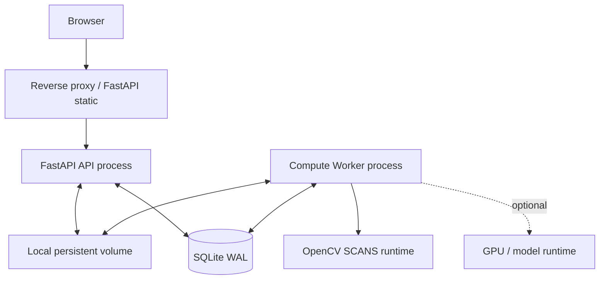

# 部署、测试与验收

## 1. 推荐运行环境

- Python 3.11：与 YOLOv13 官方示例环境一致。
- Windows 本地开发优先 PowerShell；生产建议 Linux 容器或单机服务。
- API 和 Worker 必须共享同一本地持久卷；SQLite WAL 不放 NFS/对象存储。
- OpenCV SCANS 在 Worker 内运行；CPU、内存和单批照片数必须用真实影像实测。
- 真实 YOLO 推理先做 CPU 门禁；不达标再启用 CUDA/ONNX/TensorRT provider。

## 2. 配置基线

`.env.example` 至少包含：

```dotenv
APP_ENV=development
API_HOST=127.0.0.1
API_PORT=8000
DATABASE_URL=sqlite:///./data/mosquito_mapper.sqlite3
STORAGE_ROOT=./data/artifacts
LOG_LEVEL=INFO
CORS_ORIGINS=http://127.0.0.1:8000,http://localhost:8000

MAX_UPLOAD_FILES=50
MAX_UPLOAD_FILE_BYTES=52428800
MAX_TASK_BYTES=1073741824
MAX_IMAGE_PIXELS=100000000

JOB_POLL_INTERVAL_SECONDS=1
JOB_LEASE_SECONDS=90
JOB_MAX_RETRIES=2
WORKER_CONCURRENCY=1

MOSAIC_PROVIDER=opencv
MOSAIC_WORK_SCALE=0.6
MOSAIC_PANO_CONFIDENCE_THRESHOLD=0.3
MOSAIC_BLACK_BORDER_THRESHOLD=2
MOSAIC_OUTPUT_JPEG_QUALITY=95

DETECTOR_PROVIDER=fake
MODEL_WEIGHTS_PATH=./models/best.pt
MODEL_DEVICE=cpu

DECISION_PROVIDER=rules
OPENAI_BASE_URL=
OPENAI_API_KEY=
OPENAI_MODEL=
```

生产配置的 `CORS_ORIGINS` 必须是明确 allowlist。若由 FastAPI 同源托管静态 v2.2 页面，则无需宽泛 CORS。

## 3. 本地启动体验

交付脚本应让以下流程成立：

```powershell
Set-Location -LiteralPath 'E:\vibecoding\蚊媒识别\codex-v2\v2.2\backend'
Copy-Item -LiteralPath '.env.example' -Destination '.env'
./scripts/init_db.ps1
./scripts/dev.ps1
```

另开终端：

```powershell
Set-Location -LiteralPath 'E:\vibecoding\蚊媒识别\codex-v2\v2.2\backend'
./scripts/worker.ps1
```

验证：

```powershell
./scripts/smoke_test.ps1
```

预期地址：

- 页面：`http://127.0.0.1:8000/`
- OpenAPI：`http://127.0.0.1:8000/docs`
- Readiness：`http://127.0.0.1:8000/api/v1/health/ready`

脚本中不要用未经引用的中文路径，不依赖从英文目录启动。

## 4. 单机部署拓扑



若用 Nginx/其他代理：

- SSE 路由关闭 buffering；
- 提高 read timeout；
- 限制请求体大小应不低于应用的单批上传上限；
- 只对静态 hash 资源做长期缓存；dashboard/jobs 不缓存；
- artifact 使用 ETag/Range，不向浏览器公开文件目录。

## 5. Docker/容器约束

建议至少两个进程/服务镜像可以相同但 command 不同：

- `api`: `uvicorn app.main:app --host 0.0.0.0 --port 8000`
- `worker`: `python -m app.worker`

两者挂载同一宿主机卷到 `/app/data`。SQLite 和 artifacts 放同一个可靠本地卷。镜像必须包含 `opencv-python-headless` 和 `numpy`；API 与 Worker 使用同一依赖版本。

容器健康检查：

- liveness 调 `/api/v1/health/live`；
- readiness 调 `/api/v1/health/ready`；
- Worker 通过数据库 heartbeat 由 readiness 展示，不能让 API 因 Worker 短暂重启直接崩溃。

## 6. 测试分层

### 6.1 Unit

必须快速、无网络、无 GPU：

| 模块 | 必测用例 |
|---|---|
| ROI | 少于 3 点、重复点、越界、NaN、自交、面积、自动闭合 |
| 坐标 | SVG↔native 往返误差、CSS zoom/pan 不污染结果 |
| Grid | overlap 0/20/50%、步长、ROI 过滤、四边 padding、稳定编号 |
| Transform | letterbox/pad 逆变换、tile→mosaic、clip |
| NMS | 同类重叠去重、不同类保留、阈值边界、稳定排序 |
| Review | auto state + accept/reject/reset 的有效状态 |
| Risk | 无检测、单点、多点、目标聚集指数归一化、medium<high 校验、稳定区域编号 |
| Job | 所有合法/非法状态迁移、租约过期、最大重试、取消 |
| Idempotency | 同键同请求复用、同键不同请求冲突 |
| Path | `..`、绝对路径、符号链接逃逸、恶意文件名 |
| Staleness | 依赖矩阵每一行都触发正确失效 |

### 6.2 Integration

每个测试创建临时 SQLite 和临时 storage：

- Alembic 从空库升级到 head；
- Task CRUD/筛选/归档/删除；
- multipart 上传、哈希去重、错误文件、部分成功策略；
- artifact ETag、Range、404 和归属校验；
- 两个 Worker 同时 claim 时同一 job 只能被一个领取；
- Worker 崩溃后 lease 过期，job 被重新领取；
- job event 按序持久化，SSE 从 `Last-Event-ID` 补发；
- 修改 ROI 时 `If-Match` 冲突；
- review action 的并发冲突与风险失效；
- 报告登记与物理文件提交的一致性。

### 6.3 Contract

- `GET /api/mosquito-workbench/dashboard` 可被当前 `renderSeedData()` 消费；
- OpenAPI 每个 request/response 有 schema 和示例；
- 枚举值、状态码、`application/problem+json` 固定；
- SSE 事件名与 data schema 做快照测试；
- canonical API 不返回本机绝对路径和内部 traceback。

### 6.4 End-to-end

默认使用 FakeMosaicEngine、FakeDetector、RuleBasedDecisionProvider 和小图片 fixtures：

```text
空库迁移
  → 创建任务
  → 上传 3 张 fixture
  → mosaic job
  → 保存 ROI
  → grid job
  → inference job
  → 处理全部 pending review
  → risk job
  → decision job
  → CSV/XLSX/PDF jobs
  → 下载并验证产物
```

另加三个可靠性 E2E：

1. inference 运行中杀掉 Worker，租约过期后重启，最终完成且没有重复 detection；
2. 对相同 idempotency key 连点两次，只产生一个 job/run；
3. 生成 PDF 后修改 ROI，旧 PDF 仍可审计但 `stale=true`，UI 不把它当最新报告。

### 6.5 Real integration markers

真实依赖测试不进入默认 CI：

```text
python scripts/validate_opencv_mosaic.py --input-dir "<真实样例目录>"
pytest -m yolov13_cpu
pytest -m yolov13_gpu
pytest -m llm
```

每组都要在 README 说明环境变量、样本、预期输出和资源消耗。缺依赖应 skip，不应假成功。

## 7. 测试数据与 Golden Files

- fixtures 必须小且可再分发，不使用真实政务影像；
- Fake providers 输出由输入哈希决定，禁止随机漂移；
- NMS、坐标、热点用 golden JSON；
- PDF 至少检查文件头、非零页数、关键中文文本、结果定位图 Image XObject（在工具允许时）和文件大小下限；
- XLSX 检查工作表名称、行列、数值与输入快照一致；
- 不要用“测试只断言 200”替代业务断言。

## 8. 性能与容量门禁

架构文档不承诺未经实测的 `<15 分钟`。建立 benchmark 命令，对真实代表性任务输出：

| 阶段 | 指标 |
|---|---|
| Upload | 总 MB/s、单文件校验耗时、峰值内存 |
| Mosaic | 图片数/像素、总耗时、峰值 RAM、产物大小、失败率 |
| Grid | tile 数、裁剪耗时、磁盘增量 |
| Inference | device、tile/s、总耗时、峰值 RAM/VRAM |
| NMS | 原始框数、去重后框数、耗时 |
| Risk | 点数、栅格分辨率、耗时 |
| Export | PDF/XLSX 耗时与大小 |

MVP 建议初始 SLO（需要实测校正）：

- 非上传普通 API 本机 P95 < 300 ms；
- 创建作业 < 300 ms 并返回 202；
- SSE 在 job event 写入后 1 秒内可见；
- API 常驻内存不随大图线性增长，上传/下载均流式；
- Worker 并发默认 1，先测峰值内存再提高；
- 10 个代表性任务连续处理无致命错误，才讨论正式上线。

## 9. 安全清单

### 文件与输入

- [ ] 数量、单文件、总任务容量三层限制；
- [ ] magic bytes + 解码验证，不信扩展名和浏览器 MIME；
- [ ] Pillow decompression bomb/异常像素限制；
- [ ] 临时文件和失败文件可清理；
- [ ] 文件名 HTML 转义，报告模板默认 autoescape；
- [ ] 相对路径 resolve 后仍位于 storage；
- [ ] 不允许客户端指定模型路径、命令参数或任意 OpenCV 底层参数；
- [ ] 外部工具使用参数列表调用，不做 shell 字符串拼接。

### API

- [ ] CORS allowlist；
- [ ] 合理的 body/header/timeouts；
- [ ] 错误不泄露 traceback/绝对路径/密钥；
- [ ] 下载做 artifact 归属校验；
- [ ] 对创建 job、AI、导出做简单速率/并发限制；
- [ ] `contenteditable` HTML 不直接信任；
- [ ] 正式政务部署前补 OIDC/RBAC、审计 actor 和 TLS。

### 外部依赖

- [ ] LLM 仅接收结构化统计与人工 context，不上传原图；
- [ ] provider URL 由管理员配置，防 SSRF；
- [ ] API key 只来自环境/secret store，日志脱敏；
- [ ] LLM 请求有 connect/read/overall timeout、有限重试和取消；
- [ ] YOLOv13/Ultralytics 许可证已完成交付场景审查。

## 10. 可观测性

JSON 日志样例：

```json
{
  "timestamp":"2026-08-10T08:30:12.345Z",
  "level":"INFO",
  "event":"job_step_completed",
  "request_id":null,
  "task_id":"task_uuid",
  "job_id":"job_uuid",
  "job_type":"inference",
  "step":"class_aware_nms",
  "duration_ms":381,
  "input_count":74,
  "output_count":36
}
```

最低运行指标可以先从日志/health 聚合，不强制 Prometheus：

- queued/running/failed jobs；
- job duration by type；
- Worker heartbeat；
- SQLite busy count；
- upload rejected count；
- storage used bytes；
- provider failure count；
- WAL size/checkpoint age。

## 11. 备份与恢复演练

1. 停止产生新作业或进入维护模式；
2. 等 running job 结束/安全取消；
3. 用 SQLite backup API 或受控 checkpoint 获取一致数据库快照；
4. 备份 artifacts；
5. 在新空目录恢复数据库和 artifacts；
6. 启动 API/Worker，运行 artifact integrity scan；
7. 随机打开原图、拼接预览、检测 JSON、PDF；
8. 将恢复结果和耗时记录到演练日志。

正式环境至少先完成一次恢复演练，不能只证明“备份文件存在”。

## 12. UAT 验收清单

### 功能

- [ ] 新建、搜索、筛选、切换、归档、删除任务；
- [ ] 50 张上限、50 MiB 上限、坏图和无 GPS 均给出正确反馈；
- [ ] 拼接进度真实、失败可重试、刷新页面不丢；
- [ ] ROI 保存后重新打开位置一致，无缩放漂移；
- [ ] overlap 调整改变后端网格与预计数据量；
- [ ] YOLO 结果映射正确，跨网格重复框去除；
- [ ] 低置信候选可保留/排除且留痕；
- [ ] 目标聚集指数分界满足 medium < high，重点检查区域仅使用 accepted detection，页面/建议/导出均无“个/像素²”；H01/H02 按指数排序，虚线明确为近似外包边界；
- [ ] AI 建议有证据、免责声明、版本和人工编辑；
- [ ] CSV/XLSX/PDF 中文可读、字段与页面一致；PDF 首页含带区域编号的结果定位图及编号/边界/指数说明。

### 可靠性

- [ ] API/Worker 重启后数据不丢；
- [ ] Worker 崩溃后作业恢复；
- [ ] SSE 断线续传与轮询一致；
- [ ] 重复点击不会重复作业；
- [ ] 上游变更后下游 stale；
- [ ] 磁盘满、OpenCV/NumPy 缺失或模型缺失时显示可诊断错误，不假成功。

### 交付

- [ ] Alembic 从空库升级成功；
- [ ] `.env.example` 完整且无密钥；
- [ ] 默认 pytest 全绿；
- [ ] README 启动命令在全新环境验证；
- [ ] OpenAPI、架构图、数据模型、故障处理文档一致；
- [ ] 真实模型精度和处理时延只报告实测数据；
- [ ] 未提交数据库、原图、权重、报告和日志。

## 13. 上线前必须由项目方拍板

| 决策 | 当前建议默认 | 拍板方 |
|---|---|---|
| 640 网格与 overlap | 640、20% | 技术方 |
| ROI 相交阈值 | 10%，配置化 | 技术方 + 疾控 |
| NMS IoU | 0.45 | 技术方 |
| 置信度 | min 0.20、review 0.50、auto 0.80 | 技术方 + 疾控 |
| 最小类别 | 水桶、花盆、轮胎、水箱、其他容器（以 v2.2 为基线） | 疾控方 |
| 真实 GSD/相机/飞行参数 | 绑定实际设备实测 | 飞手 + 技术方 |
| CPU/GPU | benchmark 后决定 | 技术方 |
| OpenCV SCANS 参数与适用场景 | 默认 0.6 / 0.3；真实样例 UAT 后冻结 | 技术方 + 疾控 |
| LLM 提供商与数据出域 | 默认 rules、不出域 | 项目负责人/合规 |
| 许可证 | YOLOv13 AGPL-3.0 场景审查 | 项目负责人/法务 |
