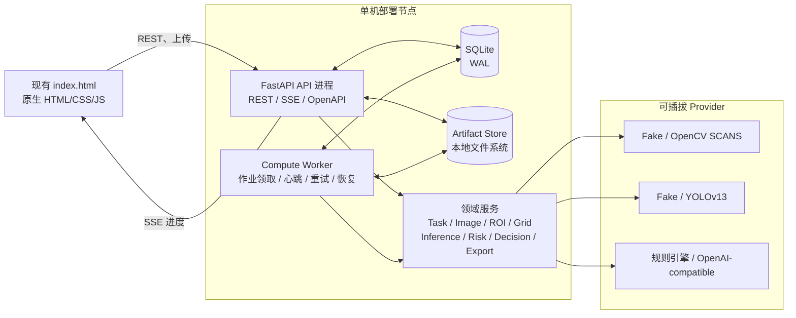
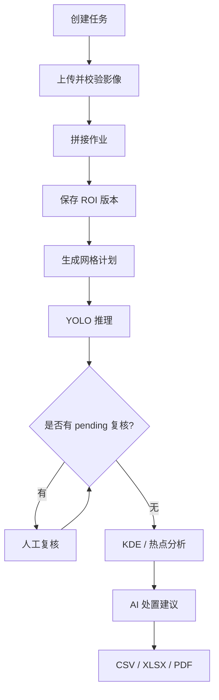
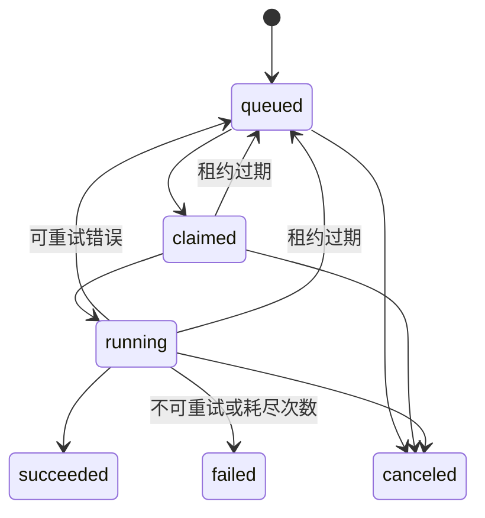
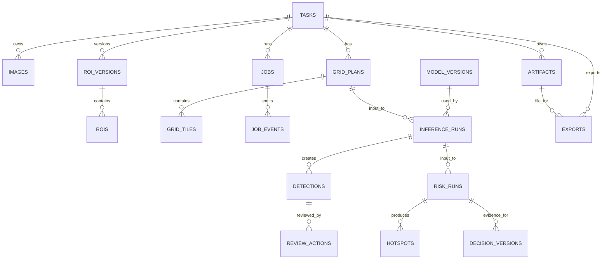
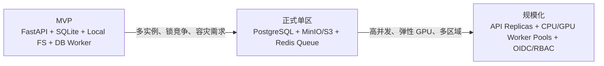

# MosquitoMapper v2.2 完整后端架构方案

本文档根据以下资料整理，用于指导 MosquitoMapper v2.2 后端设计、开发、联调、测试和后续演进：

- `00-完整后端开发提示词.md`
- `01-系统架构与任务状态机.md`
- `02-API接口契约.md`
- `03-数据模型与文件存储.md`

核心方案是：采用“模块化单体 + 独立计算 Worker + SQLite 持久化作业队列 + 本地 Artifact Store”，在不引入 Redis、Celery 和微服务的前提下，完成影像上传、拼接、ROI、网格、YOLO 推理、人工复核、风险分析、AI 建议和报告导出的完整闭环。

## 1. 架构目标与边界

### 1.1 架构目标

1. 保持 MVP 单机、低成本和易部署。
2. 拼接、推理、风险计算和报告生成等耗时任务不得阻塞 API 请求。
3. 所有作业具备持久进度、失败恢复、重试、取消和断点续传能力。
4. 所有派生结果可追溯、可版本化，上游变化后旧结果自动标记为 stale。
5. 模型、拼接引擎和决策生成器通过 Provider/Adapter 隔离，便于替换。
6. 保持与现有 `index.html`、`data.js` 和 `test_data.js` 的兼容，不重构为 React。
7. 为后续迁移 PostgreSQL、S3/MinIO、分布式队列和 GPU Worker 保留稳定边界。

### 1.2 MVP 明确不做

- 不拆微服务。
- 不引入 Redis、Celery、Kafka 或 Kubernetes。
- 不做多租户、SSO、计费、移动 App、视频流或模型训练平台。
- 不把 OpenCV SCANS 像素级拼接图宣称为测绘级正射成果。
- 不允许 API 请求传入任意模型权重路径。
- 不把影像二进制存入数据库。

## 2. 总体架构



### 2.1 部署进程

建议至少运行两个独立进程：

1. `uvicorn app.main:app`：处理 HTTP、上传、查询、SSE 和文件下载。
2. `python -m app.worker`：执行拼接、网格、推理、风险计算和报告生成。

API 进程不直接执行耗时计算，只负责参数校验、短事务、作业入队和资源查询。

### 2.2 MVP 部署约束

- API、Worker、SQLite 和 Artifact Store 必须位于同一台主机。
- SQLite 数据库不得放在 NFS 或其他网络共享文件系统上。
- 单 GPU 环境默认推理并发为 1。
- CPU 并发数根据实际内存、CPU 和 SQLite 写锁情况确定。
- 所有计算阶段不得长期持有数据库事务。

## 3. 技术栈选型

| 分类 | 选型 | 用途 |
|---|---|---|
| 语言 | Python 3.11 | 与 YOLO、OpenCV、科学计算生态兼容 |
| Web | FastAPI | REST、OpenAPI、依赖注入、SSE |
| Schema | Pydantic 2.x | 请求、响应、配置和 JSON 字段校验 |
| 配置 | pydantic-settings | `.env` 和环境变量管理 |
| ORM | SQLAlchemy 2.x | 数据访问和事务管理 |
| 迁移 | Alembic | 数据库版本化 |
| 数据库 | SQLite 3，WAL | MVP 单机业务数据和作业队列 |
| 图像读取 | Pillow + OpenCV | MIME、尺寸、解码和 EXIF 校验 |
| 几何运算 | Shapely | ROI 合法性、自交、相交面积和热点轮廓 |
| 数值计算 | NumPy、SciPy | KDE、密度栅格和坐标变换 |
| 拼接 | OpenCV SCANS + NumPy | 仿射特征匹配、曝光/接缝融合、黑边裁切 |
| 推理 | YOLOv13 Adapter | 自训练模型推理 |
| Excel | openpyxl 或 XlsxWriter | XLSX 报告 |
| PDF | ReportLab 或 WeasyPrint | 中文 PDF 报告 |
| 测试 | pytest、pytest-asyncio、httpx | 单元、集成、契约和 E2E 测试 |
| 日志 | Python logging + JSON formatter | 结构化日志 |
| 前端 | 现有 HTML/CSS/JavaScript | 保留当前视觉和交互 |

### 3.1 SQLite 初始化参数

每个数据库连接至少设置：

```sql
PRAGMA journal_mode = WAL;
PRAGMA foreign_keys = ON;
PRAGMA busy_timeout = 5000;
```

对 `SQLITE_BUSY` 只做有限、带抖动的重试。定期观察 WAL 大小并执行安全 checkpoint。

## 4. 代码目录与分层

```text
backend/
├── pyproject.toml
├── .env.example
├── alembic.ini
├── README.md
├── app/
│   ├── main.py
│   ├── worker.py
│   ├── core/
│   │   ├── config.py
│   │   ├── db.py
│   │   ├── errors.py
│   │   ├── logging.py
│   │   └── security.py
│   ├── api/
│   │   ├── router.py
│   │   ├── deps.py
│   │   ├── sse.py
│   │   └── routes/
│   │       ├── health.py
│   │       ├── dashboard.py
│   │       ├── tasks.py
│   │       ├── images.py
│   │       ├── artifacts.py
│   │       ├── jobs.py
│   │       ├── rois.py
│   │       ├── grids.py
│   │       ├── inference.py
│   │       ├── reviews.py
│   │       ├── risks.py
│   │       ├── decisions.py
│   │       └── exports.py
│   ├── domain/
│   │   ├── enums.py
│   │   ├── models.py
│   │   └── schemas.py
│   ├── services/
│   ├── repositories/
│   └── adapters/
│       ├── mosaic/
│       ├── detection/
│       └── decision/
├── migrations/
├── tests/
│   ├── unit/
│   ├── integration/
│   ├── contract/
│   ├── e2e/
│   └── fixtures/
├── scripts/
└── data/
```

### 4.1 分层职责

```text
API Route
   ↓
Application / Domain Service
   ↓
Repository + Provider Protocol
   ↓
SQLite / Artifact Store / External Engine
```

- API Route：HTTP 参数、响应码、Header、Schema 和权限边界。
- Service：工作流校验、业务规则、事务边界和依赖失效。
- Repository：SQLAlchemy 查询和持久化，不包含业务算法。
- Adapter：外部拼接、模型和 LLM 接入，不修改任务状态。
- Worker：调度服务和 Provider，记录进度、心跳和最终产物。

## 5. 领域服务划分

这里的服务是模块化单体内部的领域服务，不是独立微服务。

| 服务 | 核心职责 |
|---|---|
| `TaskService` | 任务 CRUD、归档、删除、进度派生和工作流状态校验 |
| `UploadService` | 流式上传、哈希、MIME/解码校验、EXIF、去重和限额 |
| `ArtifactService` | 产物登记、路径安全、ETag、Range 下载和原子落盘 |
| `WorkflowService` | 上下游依赖、input fingerprint、current/stale 切换 |
| `JobService` | 作业创建、幂等、领取、租约、心跳、重试、取消和恢复 |
| `ROIService` | 多边形校验、面积、版本化保存和乐观锁 |
| `GridService` | 640×640 网格、重叠、ROI 相交过滤、补边和坐标变换 |
| `InferenceService` | 模型加载、tile 推理、坐标还原、跨 tile NMS 和检测持久化 |
| `ReviewService` | 人工复核追加记录、effective state 计算和并发控制 |
| `RiskService` | accepted detection 统计、KDE、热点和风险分级 |
| `DecisionService` | 证据快照、规则/LLM 建议、Schema 校验和编辑版本 |
| `ExportService` | CSV、XLSX、PDF 生成、校验和下载产物登记 |
| `DashboardService` | canonical 数据向旧版 `data.js` 字段转换 |

### 5.1 MosaicEngine

```python
class MosaicEngine(Protocol):
    def validate(self) -> ProviderStatus: ...
    def run(
        self,
        images,
        options,
        progress_callback,
        cancel_token,
    ) -> MosaicResult: ...
    def cancel(self, external_task_id: str) -> None: ...
```

实现：

- `FakeMosaicEngine`：测试和 DEMO，输出必须明确标记为 fake/demo。
- `OpenCVMosaicEngine`：至少 2 张近似共面、重叠充分的 JPG/JPEG/PNG；使用 SCANS 仿射模型完成正式拼接，不提供测绘级保证。

### 5.2 Detector

```python
class Detector(Protocol):
    def metadata(self) -> ModelMetadata: ...
    def warmup(self) -> None: ...
    def predict(
        self,
        images: Sequence[ImageInput],
        params: DetectParams,
    ) -> list[TilePrediction]: ...
```

实现：

- `FakeDetector`：确定性测试结果。
- `YoloV13Detector`：从配置的固定权重路径加载模型。

模型启动或首次加载时登记：权重 SHA-256、类别映射、输入尺寸、Provider、设备、代码版本和加载时间。API 不允许客户端传入模型文件路径，只能引用后端已登记的 `model_version_id`。

### 5.3 DecisionProvider

- `RuleBasedDecisionProvider`：默认实现，离线可用。
- `OpenAICompatibleDecisionProvider`：可选，只发送结构化统计和人工 context，不发送原始影像。

所有 Provider 输出必须先通过 Pydantic Schema 校验，统一包含标题、优先事项、证据引用和免责声明。

## 6. 核心业务流程



### 6.1 任务进度计算

任务进度必须由当前有效产物派生，不能由用户访问了哪个页面决定。

| 条件 | 进度 |
|---|---:|
| 任务已创建 | 0% |
| 至少一批影像校验成功 | 14% |
| 拼接成功 | 28% |
| 有有效 ROI | 42% |
| 网格成功 | 57% |
| 推理成功 | 71% |
| 风险分析成功且 pending=0 | 85% |
| 有有效建议或完整报告 | 100% |

推理后仍有待复核项时保持 71%，并返回：

```json
{
  "progress": 71,
  "blocked_by": {
    "code": "PENDING_REVIEWS",
    "count": 6
  }
}
```

## 7. 作业队列设计

### 7.1 作业状态机



### 7.2 领取与租约

Worker 领取作业时：

1. 查找最早且可执行的 `queued` job。
2. 执行带状态条件的原子 `UPDATE`。
3. 写入 `worker_id`、`claimed_at`、`lease_expires_at` 和增加 `attempt_count`。
4. 受影响行数为 1 才表示领取成功。
5. 初始化成功后将状态改为 `running`。
6. 计算阶段每隔 `lease_seconds / 3` 更新一次心跳和租约。
7. Reaper 回收过期的 `claimed/running` 作业；超过最大尝试次数时标记 failed。

### 7.3 作业类型与步骤

| 作业类型 | 建议步骤 |
|---|---|
| `mosaic` | preflight → submit/process → render → quality_check → persist |
| `grid_generate` | validate_roi → enumerate → crop_pad → metadata → persist |
| `inference` | load_model → load_tiles → detect → map → nms → persist → review_queue |
| `risk_analysis` | load_effective_detections → kde → normalize → contours → persist |
| `decision_generate` | build_evidence → provider → validate_schema → persist |
| `export_csv/xlsx/pdf` | snapshot → render → validate_artifact → persist |
| `task_delete` | mark_deleting → cancel_jobs → delete_files → tombstone |

### 7.4 幂等策略

唯一约束建议为：

```text
(task_id, type, idempotency_key)
```

同时保存规范化请求的 `request_hash`：

- 同 key、同 hash：返回原 job。
- 同 key、不同 hash：返回 `409 IDEMPOTENCY_KEY_REUSED`。
- 相同 `input_fingerprint` 已有成功结果：允许直接复用结果。

## 8. 数据库设计

### 8.1 通用规范

- 所有业务主键使用 UUID，SQLite 中保存为 `TEXT`。
- `job_events.id` 使用 `INTEGER PRIMARY KEY AUTOINCREMENT`。
- 时间统一保存 UTC，API 返回 ISO 8601。
- JSON 在 SQLite 中使用 `TEXT`，写入前通过 Pydantic 校验。
- 核心可修改实体包含 `version` 整数，用于乐观锁。
- 二进制影像、拼接图和报告不进入数据库。
- 所有外键启用并根据生命周期设置合理的级联或限制策略。

### 8.2 `tasks`

| 字段 | 类型 | 说明 |
|---|---|---|
| `id` | TEXT UUID | 主键 |
| `code` | TEXT | 唯一可读编号，格式 `T-YYYYMMDD-XXXX` |
| `name` | TEXT | 任务名称 |
| `area` | TEXT | 巡查区域 |
| `survey_date` | DATE/TEXT | 业务日期 |
| `task_type` | TEXT | 例行巡查、雨后复查等 |
| `state` | TEXT | running/done/archived/deleting |
| `version` | INTEGER | 乐观锁版本 |
| `created_at` | UTC timestamp | 创建时间 |
| `updated_at` | UTC timestamp | 更新时间 |
| `archived_at` | UTC timestamp nullable | 归档时间 |
| `deleted_at` | UTC timestamp nullable | 删除墓碑时间 |

索引：

- `code UNIQUE`
- `(state, updated_at DESC)`
- `(survey_date DESC)`

### 8.3 `images`

| 字段 | 类型 | 说明 |
|---|---|---|
| `id` | TEXT UUID | 主键 |
| `task_id` | TEXT UUID | 所属任务 |
| `artifact_id` | TEXT UUID | 原图 artifact |
| `display_name` | TEXT | 客户端展示名，不作为磁盘名 |
| `sha256` | CHAR(64) | 内容哈希 |
| `mime_type` | TEXT | 服务端检测结果 |
| `size_bytes` | INTEGER | 文件大小 |
| `width/height` | INTEGER | 解码后尺寸 |
| `captured_at` | UTC timestamp nullable | EXIF 拍摄时间 |
| `gps_lat/lon/alt_m` | REAL nullable | EXIF GPS |
| `camera_make/model` | TEXT nullable | 相机信息 |
| `warnings_json` | TEXT JSON | EXIF 或校验警告 |
| `created_at` | UTC timestamp | 创建时间 |

唯一约束：`(task_id, sha256)`。

### 8.4 `artifacts`

| 字段 | 说明 |
|---|---|
| `id`、`task_id`、`job_id?` | 产物归属 |
| `kind` | original_image、mosaic、preview、grid_tile、review_crop、density_preview、predictions_json、csv、xlsx、pdf 等 |
| `relative_path` | 相对于 `STORAGE_ROOT` 的 POSIX 路径 |
| `sha256`、`size_bytes`、`mime_type` | 完整性和下载元数据 |
| `width`、`height` | 图像尺寸，可空 |
| `crs`、`affine_json` | 地理参考，可空 |
| `metadata_json` | Provider、参数和质量摘要 |
| `created_at`、`deleted_at` | 生命周期 |

`relative_path` 必须唯一，且任何时候不得向客户端返回绝对路径。

### 8.5 `roi_versions` 与 `rois`

`roi_versions`：

- `id`
- `task_id`
- `mosaic_artifact_id`
- `version`
- `coordinate_space`
- `source_width`
- `source_height`
- `fingerprint`
- `is_current`
- `created_at`

`rois`：

- `id`
- `roi_version_id`
- `code`
- `visible`
- `polygon_json`
- `area_px2`
- `area_m2`
- `geometry_wgs84_json`
- `created_at`

同一任务只能有一个当前 ROI version，可通过事务和部分唯一索引实现。

### 8.6 `grid_plans` 与 `grid_tiles`

`grid_plans`：

- `id`、`task_id`、`roi_version_id`、`mosaic_artifact_id`
- `tile_size`
- `overlap`
- `step_px`
- `edge_strategy`
- `min_roi_intersection`
- `tile_count`
- `padded_count`
- `estimated_bytes`
- `fingerprint`
- `status=current|stale`
- `created_at`

`grid_tiles`：

- `id`、`grid_plan_id`、`code`
- `source_x1/y1/x2/y2`
- `pad_left/top/right/bottom`
- `tile_to_mosaic_json`
- `roi_intersection`
- `artifact_id`

唯一约束：`(grid_plan_id, code)`。

### 8.7 `jobs` 与 `job_events`

`jobs` 主要字段：

- `id`、`task_id`
- `type`、`status`
- `progress`、`current_step`、`message`
- `input_json`、`input_fingerprint`
- `idempotency_key`、`request_hash`
- `worker_id`、`claimed_at`、`heartbeat_at`、`lease_expires_at`
- `attempt_count`、`max_attempts`
- `cancel_requested_at`
- `error_code`、`error_detail`、`error_retryable`
- `result_json`
- `created_at`、`started_at`、`finished_at`

`job_events`：

- `id INTEGER PRIMARY KEY AUTOINCREMENT`
- `job_id`
- `event_type`
- `data_json`
- `created_at`

建议索引：

```text
jobs(status, created_at)
jobs(task_id, type, status)
jobs(lease_expires_at)
job_events(job_id, id)
```

### 8.8 `model_versions`

字段：

- `id`
- `name`
- `provider`
- `weights_sha256`
- `weights_label`
- `input_size`
- `class_map_json`
- `device`
- `code_version`
- `metadata_json`
- `active`
- `created_at`

`weights_label` 只能是安全显示名，不能泄露绝对路径。

### 8.9 `inference_runs`、`detections` 与 `review_actions`

`inference_runs`：

- `id`、`task_id`、`grid_plan_id`、`model_version_id`、`job_id`
- `thresholds_json`
- `nms_iou`
- `input_fingerprint`
- `status=current|stale`
- `stats_json`
- `created_at`

`detections`：

- `id`、`inference_run_id`、`code`
- `class_id`、`class_name`、`confidence`
- `source_grid_tile_id`
- `tile_box_json`、`mosaic_box_json`
- `center_x`、`center_y`
- `auto_state=accepted|pending|discarded`
- `effective_state`
- `version`
- `created_at`

`review_actions`：

- `id`
- `detection_id`
- `action=accept|reject|reset`
- `comment`
- `actor`
- `previous_effective_state`
- `new_effective_state`
- `created_at`

检测结果不可覆盖：模型输出写入 `detections`，人工复核写入追加式 `review_actions`。当前有效状态取最后一条 review action；无人工操作时回落到 `auto_state`。

### 8.10 `risk_runs` 与 `hotspots`

`risk_runs`：

- `id`、`task_id`、`inference_run_id`、`job_id`
- `review_snapshot_version`
- `method`
- `bandwidth_px`
- `resolution_px`
- `medium_threshold`
- `high_threshold`
- `accepted_detection_count`
- `input_fingerprint`
- `status=current|stale`
- `stats_json`
- `algorithm_version`
- `created_at`

`hotspots`：

- `id`、`risk_run_id`、`code`、`name`
- `clustering_index`、`clustering_level`
- `target_count`
- `dominant_category`
- `polygon_pixel_json`
- `centroid_x`、`centroid_y`
- `geometry_wgs84_json`
- `area_px2`、`area_m2`（前者仅为图像几何数据，不作为业务密度分母）

### 8.11 `decision_versions`

字段：

- `id`、`task_id`、`risk_run_id`
- `version`
- `source=generated|edited`
- `parent_version_id`
- `provider`、`model`
- `context_text`
- `content_json`
- `evidence_snapshot_json`
- `prompt_template_version`
- `status=current|stale`
- `created_at`

用户编辑建议时必须创建新版本，不覆盖生成原文。

### 8.12 `exports`

字段：

- `id`、`task_id`、`job_id`
- `format=csv|xlsx|pdf`
- `risk_run_id`
- `decision_version_id`
- `artifact_id`
- `input_fingerprint`
- `status=queued|ready|failed|stale`
- `created_at`、`completed_at`

### 8.13 实体关系



## 9. 派生数据与 stale 机制

历史结果不删除，只将旧版本标记为 `stale`。

| 上游变化 | 需要失效的下游 |
|---|---|
| 影像增删 | mosaic、ROI、grid、inference、risk、decision、export |
| 重新拼接 | ROI、grid、inference、risk、decision、export |
| ROI 修改 | grid、inference、risk、decision、export |
| 网格参数修改 | inference、risk、decision、export |
| 模型或推理阈值修改 | inference、risk、decision、export |
| 人工复核变化 | risk、decision、export |
| KDE 或目标聚集指数分界变化 | risk、decision、export |
| 建议编辑 | 包含建议的 export |

失效操作必须与上游新版本写入放在同一个短事务中，避免旧报告继续被当作当前有效结果。

### 9.1 Input fingerprint

每个派生结果将输入规范化后计算 SHA-256，例如：

```json
{
  "operation": "inference",
  "grid_plan_fingerprint": "...",
  "model_sha256": "...",
  "infer_min_confidence": 0.2,
  "review_threshold": 0.5,
  "auto_accept_threshold": 0.8,
  "nms_iou": 0.45
}
```

规范化需要固定字段顺序、数值精度和 JSON 编码规则，保证不同进程得到一致哈希。

## 10. 坐标、ROI 与网格

### 10.1 Canonical 坐标

后端统一使用：

- 坐标空间：`mosaic_pixel`
- 原点：拼接图左上角
- x 向右、y 向下
- 数值类型：浮点数
- bbox 推荐半开区间 `[x1, y1, x2, y2)`

ROI 页面 SVG viewBox 为 `900×545` 时：

```text
native_x = svg_x / 900 × mosaic_width
native_y = svg_y / 545 × mosaic_height
```

展示时执行逆变换。CSS zoom/pan 只能用于把鼠标坐标转换回 SVG viewBox，不能进入后端数据。

### 10.2 地理坐标

只有拼接 Provider 返回可信的 CRS 和 affine transform 时，才允许生成地理坐标：

```text
X_geo = a*x + b*y + c
Y_geo = d*x + e*y + f
```

单张照片的 EXIF GPS 只能用于预检和辅助，不能用于伪造精确地理边界或平方米面积。

### 10.3 ROI 校验

- 至少三个不同顶点。
- API 不要求重复首点，后端自动闭合。
- 拒绝 NaN 和 Infinity。
- 所有点必须位于拼接图边界内。
- 拒绝明显自交多边形。
- 保存 `area_px2`。
- 只有可信 GSD/地理参考存在时才保存 `area_m2`。

### 10.4 网格算法

```text
tile_size = 640
step = round(640 × (1 - overlap))
默认 overlap = 0.20，因此 step = 512
```

处理顺序：

1. 取得 ROI 包围盒。
2. 按 step 枚举候选 tile。
3. 计算 tile 与 ROI 的相交比例。
4. 过滤低于 `min_roi_intersection` 的 tile。
5. 边缘 tile 使用 padding 补齐到 640×640。
6. 保存 source box、padding 和 tile-to-mosaic 变换。

模型坐标还原顺序：

```text
逆模型 resize/letterbox
→ 去除 tile padding
→ 加 source box 左上偏移
→ clip 到 mosaic 边界
→ 跨 tile class-aware NMS
```

## 11. 推理与风险算法

### 11.1 推理阈值

默认值：

```text
infer_min_confidence = 0.20
review_threshold = 0.50
auto_accept_threshold = 0.80
nms_iou = 0.45
```

按当前业务约束：

- `< 0.20`：丢弃。
- `0.20–0.80`：进入人工复核。
- `≥ 0.80`：自动接受。

`review_threshold=0.50` 可用于 UI 排序、低置信提示或未来疾控规则细分，但不能与“0.20–0.80 全部待复核”的当前规则产生隐式冲突。数据库和报告必须保存并展示本次 run 的完整阈值快照。

### 11.2 推理步骤

```text
load_model
→ load_tiles
→ detect
→ inverse_letterbox
→ tile_to_mosaic
→ class_aware_nms
→ persist
→ build_review_queue
```

数据库保存任务级去重后的 detection。原始 tile prediction 建议保存为 JSON artifact，用于问题追溯。

### 11.3 风险分析

风险输入只能是 `effective_state=accepted` 的检测结果：

```text
检测框中心
→ KDE 密度栅格
→ 以当前 run 峰值归一化为 0–100 的目标聚集指数
→ medium/high 聚集指数分界
→ 等值线或连通域
→ hotspot polygon + clustering_index + target_count
```

默认阈值：

```text
medium = 40
high = 75
0 <= medium < high <= 100
```

每次 risk run 保存 bandwidth、resolution、thresholds、输入检测数量和算法版本。目标聚集指数只用于当前 run 内部空间排序与分级，不代表疾病概率或布雷图指数，也不能跨 run 直接比较。没有米制标定时禁止用像素面积生成业务密度。点位不足时返回空热点和明确原因，不能制造热点。

## 12. API 设计

### 12.1 通用规则

- canonical API 前缀：`/api/v1`
- JSON 编码：UTF-8
- 字段格式：`snake_case`
- 时间格式：UTC ISO 8601
- 每个响应返回 `X-Request-ID`
- 作业创建 POST 接受 `Idempotency-Key`
- 修改带版本实体时使用 `If-Match` 或 `expected_version`
- 列表统一返回 `{items, next_cursor}`
- 默认 `limit=20`，最大 100
- 创建资源返回 `201 Created`
- 创建异步作业返回 `202 Accepted`
- 成功删除返回 `204 No Content`，或返回 deletion job
- 二进制资源统一通过 artifact API 下载

### 12.2 系统与兼容层

| 方法 | 路径 | 说明 |
|---|---|---|
| GET | `/api/v1/health/live` | API 进程存活 |
| GET | `/api/v1/health/ready` | 数据库、存储、Worker 和 Provider 就绪检查 |
| GET | `/api/v1/version` | 应用版本、迁移版本、Provider 和上传限制 |
| GET | `/api/mosquito-workbench/dashboard?task_id=` | 旧版 `data.js` 兼容门面 |

Dashboard 顶层至少保留：

```text
tasks
demoImages
rois
model
risk
```

可额外返回 `meta.current_task_id`、`meta.api_version` 和 `meta.capabilities`。

### 12.3 Tasks

| 方法 | 路径 | 说明 |
|---|---|---|
| GET | `/api/v1/tasks` | 搜索、状态筛选和 cursor 分页 |
| POST | `/api/v1/tasks` | 创建任务 |
| GET | `/api/v1/tasks/{task_id}` | 任务详情、进度和当前产物 |
| PATCH | `/api/v1/tasks/{task_id}` | 乐观锁更新任务 |
| POST | `/api/v1/tasks/{task_id}/archive` | 归档任务 |
| DELETE | `/api/v1/tasks/{task_id}` | 删除或创建 deletion job |

### 12.4 Images 与 Artifacts

| 方法 | 路径 | 说明 |
|---|---|---|
| GET | `/api/v1/tasks/{task_id}/images` | 获取影像元数据 |
| POST | `/api/v1/tasks/{task_id}/images` | multipart 批量上传 |
| DELETE | `/api/v1/tasks/{task_id}/images/{image_id}` | 删除影像并使下游 stale |
| GET | `/api/v1/artifacts/{artifact_id}/content` | ETag、Range 和安全下载 |

批量上传推荐采用逐文件持久化策略，分别返回 `accepted`、`duplicates` 和 `rejected`，避免一张坏图使整批成功文件丢失。

### 12.5 Jobs 与 Mosaic

| 方法 | 路径 | 说明 |
|---|---|---|
| POST | `/api/v1/tasks/{task_id}/mosaic-jobs` | 创建拼接作业 |
| GET | `/api/v1/jobs/{job_id}` | 作业状态轮询 |
| POST | `/api/v1/jobs/{job_id}/cancel` | 请求取消 |
| GET | `/api/v1/jobs/{job_id}/events` | SSE 进度流 |

### 12.6 ROI 与 Grid

| 方法 | 路径 | 说明 |
|---|---|---|
| GET | `/api/v1/tasks/{task_id}/rois` | 获取当前 ROI 版本 |
| PUT | `/api/v1/tasks/{task_id}/rois` | 覆盖保存新版本 |
| POST | `/api/v1/tasks/{task_id}/grid-plans/preview` | 纯计算网格预览 |
| PUT | `/api/v1/tasks/{task_id}/grid-plan` | 持久化并创建网格作业 |

### 12.7 推理与复核

| 方法 | 路径 | 说明 |
|---|---|---|
| POST | `/api/v1/tasks/{task_id}/inference-jobs` | 创建推理作业 |
| GET | `/api/v1/tasks/{task_id}/detections` | 检测结果查询 |
| GET | `/api/v1/tasks/{task_id}/reviews?status=pending` | 待复核列表 |
| PATCH | `/api/v1/tasks/{task_id}/reviews/{detection_id}` | accept/reject/reset |

### 12.8 风险、建议与导出

| 方法 | 路径 | 说明 |
|---|---|---|
| POST | `/api/v1/tasks/{task_id}/risk-runs` | 创建风险分析 |
| GET | `/api/v1/tasks/{task_id}/results` | 获取当前风险结果 |
| POST | `/api/v1/tasks/{task_id}/decisions` | 创建建议版本 |
| GET | `/api/v1/tasks/{task_id}/decisions` | 获取建议版本历史 |
| PATCH | `/api/v1/tasks/{task_id}/decisions/{version_id}` | 保存人工编辑新版本 |
| POST | `/api/v1/tasks/{task_id}/exports` | 创建 CSV/XLSX/PDF 导出 |
| GET | `/api/v1/tasks/{task_id}/exports` | 获取导出历史和下载链接 |

### 12.9 错误响应

错误统一使用 `application/problem+json`：

```json
{
  "type": "https://mosquito-mapper.local/problems/version-conflict",
  "title": "资源版本冲突",
  "status": 409,
  "detail": "ROI 已被其他请求更新，请刷新后重试。",
  "instance": "/api/v1/tasks/{task_id}/rois",
  "code": "VERSION_CONFLICT",
  "request_id": "req_...",
  "errors": []
}
```

至少覆盖：

- `VALIDATION_ERROR`
- `VERSION_CONFLICT`
- `INVALID_WORKFLOW_STATE`
- `INVALID_POLYGON`
- `UPLOAD_LIMIT_EXCEEDED`
- `UNSUPPORTED_MEDIA_TYPE`
- `TASK_NOT_FOUND`
- `ARTIFACT_NOT_FOUND`
- `MODEL_NOT_CONFIGURED`
- `MOSAIC_ENGINE_NOT_CONFIGURED`
- `JOB_ALREADY_RUNNING`
- `JOB_FAILED`
- `IDEMPOTENCY_KEY_REUSED`

## 13. SSE 设计

事件类型：

```text
snapshot
job.queued
job.started
job.progress
job.step
job.succeeded
job.failed
job.canceled
heartbeat
```

规则：

- 事件先持久化到 `job_events`，再推送。
- `job_events.id` 直接作为 SSE `id`。
- 支持请求头 `Last-Event-ID` 补发断线期间事件。
- 首次连接先发送 snapshot。
- 每 15 秒发送 heartbeat。
- 终态事件发送后可以结束连接。
- 前端保留 `GET /jobs/{job_id}` 轮询兜底。
- 响应设置 `Cache-Control: no-cache`，代理层关闭缓冲并提高长连接超时。

## 14. 文件存储设计

```text
backend/data/
├── mosquito_mapper.sqlite3
├── mosquito_mapper.sqlite3-wal
├── mosquito_mapper.sqlite3-shm
└── artifacts/
    └── tasks/{task_uuid}/
        ├── originals/
        │   └── {image_uuid}.jpg
        ├── mosaic/{job_uuid}/
        │   ├── mosaic.jpg
        │   ├── preview.jpg
        │   └── quality.json
        ├── grids/{grid_plan_uuid}/
        ├── inference/{run_uuid}/
        │   ├── raw_predictions.json
        │   ├── annotated_preview.jpg
        │   └── review_crops/
        ├── risk/{risk_run_uuid}/
        │   ├── density.png
        │   └── hotspots.geojson
        ├── decisions/{version_uuid}/
        ├── exports/{export_uuid}/
        └── tmp/{job_uuid}/
```

数据库只保存类似下面的相对路径：

```text
tasks/{task_uuid}/mosaic/{job_uuid}/preview.jpg
```

路径解析必须：

1. 拒绝绝对路径和 `..`。
2. 解析 `STORAGE_ROOT / relative_path`。
3. 验证解析结果仍是 Storage Root 的后代。
4. 文件名使用服务端 UUID 和受控扩展名。
5. 临时文件和最终文件位于同一文件系统。
6. 同步计算 SHA-256，成功后原子 rename。

## 15. 上传与文件安全

- 默认每批最多 50 张。
- 默认单文件最大 50 MiB。
- 任务总存储量限制配置化。
- 扩展名不可信，联合检查 magic bytes、Pillow/OpenCV 解码结果。
- 拒绝 SVG、可执行文件、路径穿越和图像解压炸弹。
- 限制最大像素数量和异常宽高比。
- EXIF 解析异常记录 warning，不导致整批崩溃。
- 相同 task + SHA-256 默认去重。
- 客户端文件名只作为 `display_name`，输出 HTML/PDF 前转义。
- Artifact 下载检查任务归属、数据库记录、物理文件和路径边界。
- 下载响应的 Content-Type 和 Content-Disposition 由服务端生成。

## 16. AI 建议与报告

### 16.1 AI 建议

AI 建议只能基于已经保存的证据：

- 重点检查区域、目标聚集指数和类别统计
- 目标聚集指数分界
- 人工复核结果
- ROI 面积
- 人工输入的 context

结构化输出至少包含：

- `title`
- `priorities[]`
- `evidence[]`
- `disclaimer`
- `provider`
- `model`
- `created_at`

始终显示：

> AI 建议为辅助信息，最终处置决定由疾控专业人员确认。

### 16.2 导出

- CSV：UTF-8 BOM，便于中文 Excel 打开。
- XLSX：至少包含任务汇总、类别统计、聚集区域、检测明细和审计参数。
- PDF：嵌入可用的中文字体；首页嵌入拼接底图、目标聚集颜色、H01/H02 等编号和近似边界；正文解释编号规则、边界含义、指数口径和现场处置；生成后校验最小文件大小、页数和地图图像对象。
- 报告绑定 `task_version`、`inference_run_id`、`risk_run_id` 和 `decision_version_id`。
- 报告不得保存或引用未来会失效的临时 URL。

## 17. 前端联调方案

建议分两步完成：

1. 先把 `data.js` 的数据源切到 `/api/mosquito-workbench/dashboard`，保持旧字段结构。
2. 再逐项将 `setInterval`、`setTimeout` 和本地假数据动作替换成 canonical API。

| 当前动作 | 真实接口 |
|---|---|
| `loadDynamicData` | GET dashboard |
| `createTask` | POST tasks |
| `selectTask` | GET dashboard?task_id= |
| `loadFiles` | POST images |
| `resetUpload` | DELETE images |
| `startStitch` | POST mosaic-jobs + SSE |
| ROI 保存 | PUT rois |
| `renderGrid` | POST grid-plans/preview |
| `runModel` | POST inference-jobs + SSE |
| `resolveReview` | PATCH review |
| `updateRisks` | POST risk-runs |
| `generateAi` | POST decisions |
| 导出按钮 | POST exports + artifact 下载 |

必须保留显式 DEMO 模式，例如 `?demo=1`，并在页面明显显示 DEMO。生产环境默认关闭 DEMO。网络失败只能显示真实错误和重试按钮，不能自动回落到假成功。

## 18. 配置与可观测性

### 18.1 环境变量

`.env.example` 至少包含：

```text
APP_ENV
API_HOST
API_PORT
DATABASE_URL
STORAGE_ROOT
LOG_LEVEL
CORS_ORIGINS
MAX_UPLOAD_FILES
MAX_UPLOAD_FILE_BYTES
MAX_TASK_BYTES
JOB_POLL_INTERVAL
JOB_LEASE_SECONDS
JOB_MAX_RETRIES
MOSAIC_PROVIDER
MOSAIC_WORK_SCALE
MOSAIC_PANO_CONFIDENCE_THRESHOLD
MOSAIC_BLACK_BORDER_THRESHOLD
MOSAIC_OUTPUT_JPEG_QUALITY
DETECTOR_PROVIDER
MODEL_WEIGHTS_PATH
MODEL_DEVICE
DECISION_PROVIDER
OPENAI_BASE_URL
OPENAI_API_KEY
OPENAI_MODEL
```

### 18.2 日志

使用 JSON 结构化日志，至少包含：

```text
timestamp
level
request_id
task_id
job_id
step
duration_ms
error_code
```

不得记录文件二进制、密钥、完整 LLM prompt 或敏感 EXIF。

### 18.3 健康检查

- `live`：只表示 API 进程可响应。
- `ready`：检查数据库可写、Storage 可写、Worker 心跳和所选 Provider 状态。
- 测试或 DEMO 使用 fake Provider 时允许真实模型未配置；生产拼接必须配置 opencv 且 cv2/numpy 可导入。
- production 选择真实 Provider 且依赖不可用时，`ready=false`。

## 19. 测试体系

### 19.1 单元测试

- ROI 自交、越界和面积。
- SVG/native 坐标转换。
- 网格步长、覆盖和 padding。
- tile-to-mosaic 坐标还原。
- class-aware NMS。
- 目标聚集指数分界校验。
- Job 状态机。
- stale 依赖传播。
- 路径安全和幂等。

### 19.2 集成测试

- 临时 SQLite + 临时 Storage。
- Task CRUD、上传、Artifact 和 Range。
- Job claim、lease、retry 和 recovery。
- SSE 断线补发。
- 复核并发冲突。
- CSV、XLSX 和 PDF 导出。

### 19.3 契约测试

- Dashboard 响应兼容 `test_data.js`。
- OpenAPI 中所有端点具备请求、响应 Schema 和示例。
- 所有错误符合 `application/problem+json`。

### 19.4 E2E 测试

使用 Fake Provider 完成：

```text
创建任务
→ 上传 fixture
→ 拼接
→ ROI
→ 网格
→ 推理
→ 人工复核
→ 风险分析
→ 决策建议
→ PDF
```

还需要验证：

- Worker 重启后过期租约作业可恢复。
- 重复提交幂等键不会产生两次推理。
- 上游变化后旧风险和报告变为 stale。
- SSE 可从 Last-Event-ID 继续。

默认测试不得依赖网络、GPU 或真实模型。OpenCV 使用合成图做确定性单测，并提供真实样例目录的独立回归命令。

## 20. 实施顺序

### M0：基础骨架

- 配置、日志、数据库和 Alembic。
- health、version 和错误响应。
- pytest 基础设施。

### M1：任务与影像

- Tasks、Images、Artifacts。
- Dashboard 兼容接口。
- 首屏、任务切换和上传使用真实数据。

### M2：作业系统与拼接

- 持久化 Jobs、Worker、SSE。
- Fake/OpenCV Mosaic。
- 租约、心跳、重试、取消和恢复。

### M3：ROI 与网格

- 坐标换算、ROI 版本和乐观锁。
- Grid preview/persist。
- 上游变化使下游 stale。

### M4：推理与复核

- Detector Protocol、Fake 和 YOLOv13 Adapter。
- 坐标还原、NMS、detections 和人工复核。

### M5：风险、建议和报告

- KDE、目标聚集区域和目标聚集指数分界。
- 规则/LLM 建议。
- CSV、XLSX 和 PDF。

### M6：联调与验收

- 替换前端模拟行为。
- 完整 E2E、安全测试和契约测试。
- PowerShell 启动脚本、Smoke Test 和 README。

## 21. 正式化升级路线



升级时重点保持以下接口稳定：

- Repository
- Artifact Store
- MosaicEngine
- Detector
- DecisionProvider
- Job Handler

SQLite 迁 PostgreSQL 后 JSON 字段可改为 JSONB；本地 Artifact Store 可替换为 S3/MinIO；数据库队列可替换为 Redis/Celery 或其他消息队列，但领域服务和 API 契约不需要推翻。

## 22. 最终验收标准

- 空数据库启动 API 与 Worker 后无需手工改库即可使用。
- 新建任务、上传 fixture、拼接、ROI、网格、推理、复核、风险、建议和 PDF 全链路成功。
- 刷新页面或重启 API 后数据和进度不丢失。
- Worker 异常退出后，过期租约任务能恢复或明确失败。
- SSE 断线可从 Last-Event-ID 续传，轮询可得到一致终态。
- 重复点击开始推理或导出不会重复创建相同作业。
- 上游变更后旧风险和旧报告被标记为 stale。
- Dashboard 契约与 v2.2 当前页面兼容。
- 所有下载均来自受控 Artifact Endpoint。
- pytest 默认测试全部通过，OpenAPI 可访问，README 命令可直接复制执行。
- 仓库不包含密钥、真实数据、模型权重、数据库和大型运行产物。
- 没有真实权重或外部 LLM 时，Fake Detector/规则 Provider 仍能完成完整 E2E；生产拼接固定使用 OpenCV SCANS，依赖缺失时必须返回明确错误，不能把假结果当真实结果。
