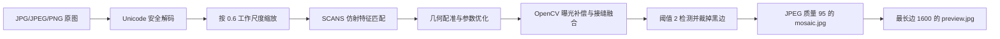

# OpenCV SCANS 最新图像拼接方案

## 1. 变更结论

本项目的正式拼接策略统一为 OpenCV `Stitcher_SCANS`。旧的 `PANORAMA` 模型和 NodeODM 占位策略不再属于当前方案。

最新版实现来源：

- 代码：`E:\图像识别\预处理-图像拼接-hzz\拼接\opencv_stitch.py`
- 使用说明：同目录 `使用步骤.docx`
- 图像处理说明：同目录 `去噪、增强对比度？.docx`
- 已验证样例：6 张 `3360 × 2669` 影像，输出 `4839 × 2722`。

## 2. 适用范围

必须同时满足：

1. 至少 2 张 JPG、JPEG 或 PNG；
2. 影像属于同一连续区域；
3. 相邻影像具有足够的可识别重叠内容；
4. 场景近似共面，适合仿射扫描模型；
5. 不混入其他地点、无关截图或拼接结果文件。

文件名可以自定义。后端按显示文件名做稳定排序，但几何关系由特征匹配决定，不依赖 `tile_r01_c01` 这类命名。

## 3. 处理流程

Worker 进度阶段为：

`preflight → load_images → feature_registration → seam_blending → render → quality_check → persist`

OpenCV 的 `stitch()` 是同步计算，无法在函数内部安全中断；系统会在调用前、调用后、裁切后和持久化前检查取消与超时。

## 4. 默认参数

| 环境变量 | 默认值 | 含义 |
|---|---:|---|
| `MOSAIC_PROVIDER` | `opencv` | 正式拼接 Provider |
| `MOSAIC_WORK_SCALE` | `0.6` | 特征匹配和输出工作尺度 |
| `MOSAIC_PANO_CONFIDENCE_THRESHOLD` | `0.3` | Stitcher 置信阈值 |
| `MOSAIC_BLACK_BORDER_THRESHOLD` | `2` | 黑边有效像素阈值 |
| `MOSAIC_OUTPUT_JPEG_QUALITY` | `95` | 主拼接图 JPEG 质量 |

这些参数由服务端配置，不允许客户端提交任意 OpenCV 参数。

## 5. 输入与产物

上传 API 仅接受 JPEG 和 PNG。旧数据库中如果仍存在 TIFF，创建 OpenCV 拼接任务时会返回 `MOSAIC_INPUT_UNSUPPORTED`。

每次成功任务产生：

| 产物 | 格式 | 用途 |
|---|---|---|
| `mosaic.jpg` | JPEG 95 | ROI、网格与推理使用的主拼接图 |
| `preview.jpg` | JPEG 88 | 前端快速预览 |
| `quality.json` | JSON | 参数快照、输入数量和质量说明 |

`quality.json` 记录 `strategy=opencv_scans_affine`、工作尺度、置信阈值、黑边是否裁切、源影像数、GPS 完整率和输出格式。

## 6. 原图预处理原则

默认不对单张原图做去噪、CLAHE、对比度增强、Gamma 或锐化。原因是：

- 可能破坏屋顶边缘和纹理特征，降低匹配质量；
- 单图增强程度不一致会放大亮度差和接缝；
- 过度锐化会产生光晕与重影；
- OpenCV Stitcher 已执行曝光补偿和接缝融合。

仅当真实批次存在明确的噪点、雾霾或整体偏暗问题时，才通过独立评估决定是否增加轻量处理。若只是成图略平，可在拼接和裁边完成后对最终图做轻量 CLAHE；它不属于当前默认流水线。

## 7. 错误契约

| 错误码 | 含义 | 用户处理 |
|---|---|---|
| `MOSAIC_INPUT_INSUFFICIENT` | 少于 2 张影像 | 补充同一区域影像 |
| `MOSAIC_INPUT_UNSUPPORTED` | 存在 TIFF 等不支持格式 | 转成 JPG/PNG 后重新上传 |
| `MOSAIC_INPUT_INVALID` | 文件无法解码或读取 | 删除损坏文件后重传 |
| `MOSAIC_STITCH_FAILED` | 匹配不足或仿射估计失败 | 检查重叠、清晰度和混入照片 |
| `MOSAIC_RENDER_FAILED` | JPEG 编码或写盘失败 | 检查磁盘与目录权限 |
| `MOSAIC_ENGINE_NOT_CONFIGURED` | 缺少 OpenCV/NumPy | 重新安装项目依赖 |

## 8. 几何与业务边界

该输出是近似共面影像的像素级拼接图：

- ROI 和检测结果使用拼接图原生像素坐标；
- 不生成 CRS、GSD 或 affine 地理变换；
- GPS 只进入质量摘要，不用于伪造地理参考；
- 不得把结果表述为测绘级正射成果；
- 若未来确有测绘精度需求，应作为独立能力重新设计和验收，不能改变当前结果语义。
